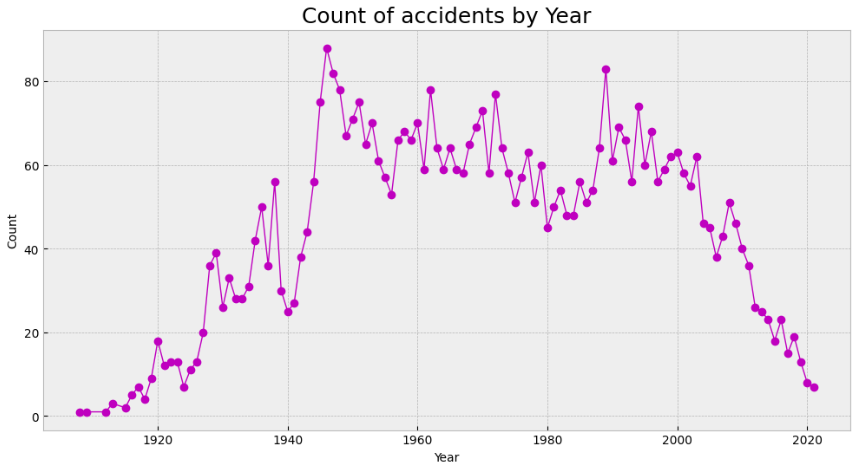
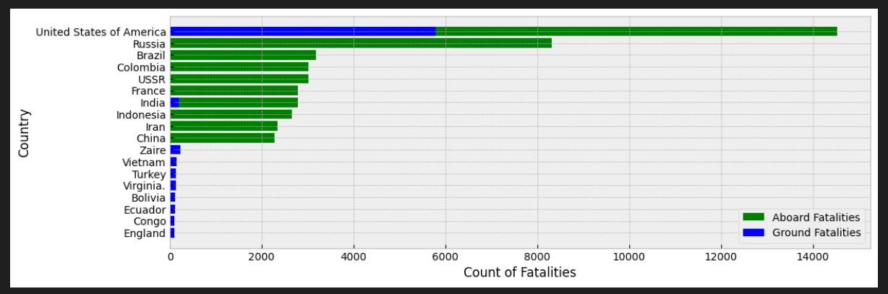

# <h1 align=center> Analytics Project - HENRY DATA SCIENCE <h/>
## <h2 align=center> Airplane Crashes <h/>
### <h3 align=center> By Angel Bello Merlo <h/>

## Topic

Air accidents are unexpected and unwanted events that involve aircraft and cause physical damage to people or to the aircraft itself. A plane crash can involve any type of aircraft, including commercial jets, private jets, helicopters, gliders, and hot air balloons.

Air crashes can be caused by a variety of factors, including human error, equipment failure, weather issues, maintenance issues, air traffic management failures, design issues, or manufacturing issues. And as for its consequences, they can be both in terms of human and economic losses.

That's why the aviation industry, regulatory authorities, and researchers work tirelessly to improve aviation safety and prevent future accidents.

For this reason, the analysis of historical air accident data is essential to improve aviation safety. The systematic collection and analysis of crash data can help investigators identify patterns, trends, and contributing factors that could lead to improvements in safety, from helping improve the training of pilots and maintenance personnel, as well as to improve the design and manufacture of aircraft and aviation equipment.

## ETL process
Extract, Transform and load process was carried out following these steps.

Original Dataset:
[Original Dataset ](https://github.com/Abyzou1995/PI02_DATA10_Analytics_AirCrashes/tree/main/Dataset_original)

This process can be seen there:
[ETL Analytics ](https://github.com/Abyzou1995/PI02_DATA10_Analytics_AirCrashes/blob/main/ETL.ipynb)
Dataset after ETL:
[ETL Dataset ](https://github.com/Abyzou1995/PI02_DATA10_Analytics_AirCrashes/tree/main/Dataset_final)

## EDA 
Exploratory Data Analysis was carried out following these steps.
+ Cleaning datased done.
+ Use libraries like pandas_profiling, missingno, pandas, matplotlib.
+ Investigate the relationships between the variables of the datasets.
+ The EDA should include interesting graphs to extract data.
+ Check if there are outliers or anomalies.

This process can be seen there:
[EDA Analytics ](https://github.com/Abyzou1995/PI02_DATA10_Analytics_AirCrashes/blob/main/EDA.ipynb)
Dataset after EDA:
[EDA Dataset ](https://github.com/Abyzou1995/PI02_DATA10_Analytics_AirCrashes/tree/main/Dataset_final)

## KPIs

1. Mortality Rate: This KPI describes the rate of number of fatalities over the total number of people aboard.

      $$Rate=N° Fatalities/N° Aboard$$

2. Accident Fatality Rate: This KPI describes the rate of number of accidents with at least one fatality over the total number of accidents that occurred.

      $$Rate=N° Accidents With Fatalities/N° Accidents$$

3. Accident Death Rate:This KPI describes the rate of number of accidents with at least one fatality over the total number of accidents that occurred.

      $$Rate=N° Fatalities/N° Accidents$$

4. Variation Accidents Rate:This KPI describes the variation in the number of accidents that occurred in one year compared to the previous one.

      $$Rate=(N° Accidents (N)year-N°Accicents(N-1)Year) /N°Accicents(N-1)Year$$

This process can be seen there:
[KPIs Analytics ](https://github.com/Abyzou1995/PI02_DATA10_Analytics_AirCrashes/blob/main/KPI.ipynb)

## Analysis and Conclusions

1. The most accidents occurred in the range of 8-20 hours and this has a relationship to the high number of fatalities that occurred in the same range, the highest number of accidents at 11(6.05%) and the highest number of fatalities at 14(6.06%).
2. The most accidentes occurred in the range of December to January and this has a not very clear relationship to the high number of fatalities that occurred in the same range, cause the most fatalities ocurred in the range of July to December, but the highest number of fatalities(9.78%) and number of accidents(9.90%) occurred in December.
3. The most accidents occurred in the range of Tuesday to Saturday and this has a relationship to the high number of fatalities that occurred in the same range, the highest number of accidents on Tuesday(15.19%) and the highest number of fatalities on Wednesday(15.48%).
4. The most accidents occurred in the range of first days of month and this has a relationship to the high number of fatalities that occurred in the same range, the highest number of accidents on 8th day of month(3.67%) and the highest number of fatalities on 3rd day of month(4.71%).
5. The most accidents occurred in the range of 1944-2003 year and this has a relationship to the high number of fatalities that occurred in the same range, the highest number of accidents in 1946(88,1.75%) and 1989(83,1.65%) and the highest number of fatalities in 1972(2.50%).
6. The ground fatalities has a defined trend over the years except 2001 due to attack on the Twin Towers.
7. The most fatalities(13.03%) and most accidents(20.16%) occurred in The United States of America, followed by Russia and Brazil respectively in both metrics.
8. The most fatalities(5.06%) and most accidents(7.90%) occurred by Aeroflot operator which is a Russian airline, it would explain why Russia is top 2 in accidents and fatalities; followed by some U.S.A operators which would explain why The United States had most fatalities and accidents.
9. The most fatalities and accidents occurred by Douglas airplane models like DC-3,C-47,DC-6B,DC-4, etc.
10. There is a high correlation between the number of passengers and the total number of people on board(100%), this would be explained because the majority of people on board are passengers, and it also has a medium correlation with the total number of fatalities(75%), this would be explained because the greater the number of of people on board there is a greater probability of a greater number of fatalities.

## Dashboard
+ Making data available using the Streamlits framework.
+ Streamlist is an unified cloud to build and run all your apps and websites.

Deployed Dashboard can be seen there:
[Dashboard ](https://abyzou1995-pi02-data10-analytics-aircrashes-dashboard-79frry.streamlit.app)

